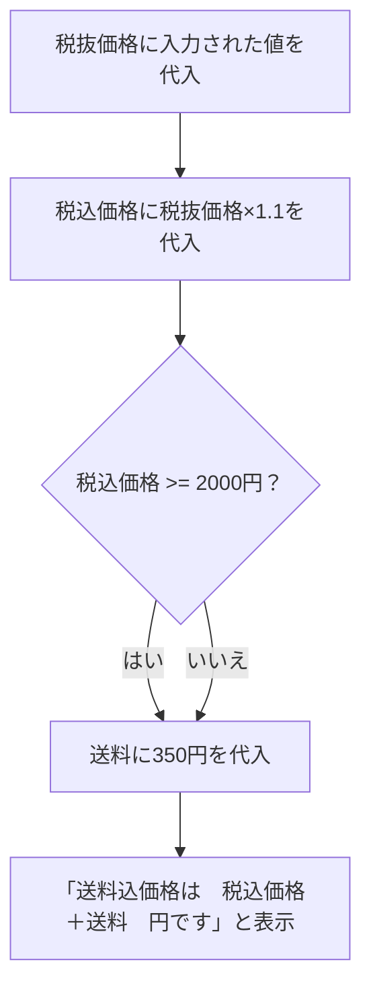

# SE入門研修

SE入門研修　lesson 5　アルゴリズムとプログラミング  11:55 ~　13：55一旦区切る

## 分かったこと

分かったこと：
      フローチャートの話があり、Mermaid記法というものでフローチャートを書くことができると知ったので試したところ、使いやすかったので身に着けたい。
      アルゴリズムのチャプターがあり、いままではあまり計算量を意識していなかったが、DBから従業員を探すシステムなどを作成することは普通にあると思うので、将来的な拡張も意識して考えたい。
      プログラミング言語のチャプターで、インタプリタは配布時に実行ファイルとしてまとめられないので、ソースコードが外部に見えやすいというリスクがある。
      ソースコードを読みやすくするコツとして、この変数が必用な理由や、アルゴリズムを選んだ理由をコメントとして書くと良い。
      命名規則について、snake_case, camelCaseの存在は知っていたが、その使い分けは分かっておらず、Pythonならすべてsnake_caseを使っていたが、定数なら全て大文字にしたり、プライベート変数なら先頭にアンダースコアを付けたり、クラス名ならUpperCamelCaseにすると知った。
      組み込み関数や型名の使用を避けるとあり、以前組み込み関数を変数にしてしまって苦戦した苦い思い出があるので、気を付ける。

分からなかったことと改善方法：
      例外処理の話があった。自分はexceptの後の構文に知識がないので、０除算や数値チェック以外にも何があるのか公式ドキュメント等で調べる。
      多次元リストとPandas等のデータフレームは何が違うのか、DBを扱う場合はどちらがいいのか調べる。
      ミドルウェアの説明があり、Apache、SQLAlchemy以外知らなかった。説明があまりなかったため、自分で調べる。

## 分からなかった事と改善方法

## フローチャート

## 課題

A. int

B. tax_excluded_price * (1 + tax_rate)

C. tax_included_price >= 2000

D. else:

E. total_price = tax_included_price + shipping_cost

